# PP2-Gro-list

Link to live website: (https://rodrivazquezasenjo.github.io/PP2-Gro-list/)

## **Overview**
GroList is a website produced as a deliverable for the Code Institute Full Stack Development Software Diploma course. It is an online tool allowing you to keep track of your pantry items, create live grocery shopping lists and test your knowledge on diets. It is the second project of the course and highlights the use of HTML, CSS and JavaScript.  

## Table of Contents.

1. [Overview](#overview)
2. [User Experience](#user-experience)
3. [Technologies Used](#technologies-used)
4. [Testing](#testing)
5. [Deployment](#deployment)
6. [Credits](#credits)
7. [Acknowledgements](#acknowledgements)
8. [Contact Information](#contact-information)

## User Experience

To describe the User Experience design process of the website, the 5 planes of UX design will be discussed below. 

### **1. Strategy Plane**

At this level thep project objectives and aspirations, and the users
serving those objectives are identified.

- **Product Objective**: To create a platform where potential users can use the website as a place for their grocery needs.

- **User Needs**:

  - **Client:** To create a simple and attractive website which is intuitive and allows users to navigate comfortably while meeting their grocery needs.

  - **Customer:** To be able to navigate within the page intuitively, and to provoke positive reactions to grocery endoavours which are usually not attractive. 

- **Business Objectives**: To provide an easy tool which can enhance grocery shopping.

#### **User Stories:**

- **Client Story \#1:** To create a modern website which easily lays out the purpose of tool.

  - **<u>Acceptance:</u>** The website will be dynamic and modern in aesthetics, it’ll include a landing page which guides you to the relevant sections and there will always be a way to navigate to any section..

- **Client Story \#2:** To allow users to keep track of their pantry items.

  - **<u>Acceptance:</u>** The user will be able to easily update, add or remove the pantry items on the pantry section as they cook or buy ingredients. 

- **Customer Story \#1:** To allow users to make grocery lists.

  - **<u>Acceptance:</u>** The user will be able to add ingredients, number of ingredients and whether they've bought it.

- **Customer Story \#2:** The users will be able to test their knowledge on diets with a quiz

  - **<u>Acceptance:</u>** The user will be able to start a quiz to see if an ingredient is or isnt part of a diet with a quiz. 

### **2. Scope Plane**

Once the strategy is set and the abstract objectives have been defined,
we can contextualize this in the Scope Plane. The objectives will be
reviewed into clear goals, which will be fulfilled by a list of features
the website will need to follow.

#### **Features**

The website will have four different pages which will be accessible at
any point from any of the pages, you’ll land on the home page which will
guide you to the dashboard where each of the other three pages will be accessible from.
The second page will be a dynamic tool which allows you to add or remove pantry items. It'll also allow you to modify them.
The third page will be a grocery list which will allow you to add a predetermined list based on your diet. 
The fourth page will be a quiz testing your knowledge on diets. 

### **3. Structure Plane**

The website provides a structured navigation experience across its pages, beginning with the home page where users are welcomed by a slogan and an access button that directs them to the dashboard. This dashboard features three cards for easy navigation to the pantry, grocery list, and quiz pages. A persistent navigation bar at the top of each page allows users to move between these main sections, and a footer at the bottom provides links to the author's GitHub and LinkedIn profiles, as well as a disclaimer about the site's educational purpose.

The Pantry page is designed for efficient management of pantry inventory. The header includes navigation links and a button to access a side menu. The main content area is split into a title section with instructions and a functional section where users can view and manage their pantry items. An add-item button opens a form overlay where users can enter details about new items. The footer mirrors the links and disclaimer found on other pages.

The Grocery List page is organized into sections for ease of use, starting with a header that includes navigation and a side menu button. The title section introduces the page and includes a form for selecting predefined grocery lists. The functional section features a table for tracking grocery items and their quantities, with buttons to add or remove rows. The footer provides consistent links and a disclaimer about the site’s data handling and educational use.

The Quiz page offers a logical layout with a header that includes the site's title or logo. Users can set the number of quiz rounds and start the quiz from the control panel. The main content displays quiz questions with ingredient images and interactive answer buttons. A score display provides real-time feedback on correct and incorrect answers. At the end of the quiz, users see their results and have the option to restart the quiz. The layout is responsive, ensuring a smooth experience on various devices, and the footer provides the usual links and disclaimer.

### **4. Skeleton Plane**

At the skeleton plane the layout of the website is designed. Wireframes can be used for this:

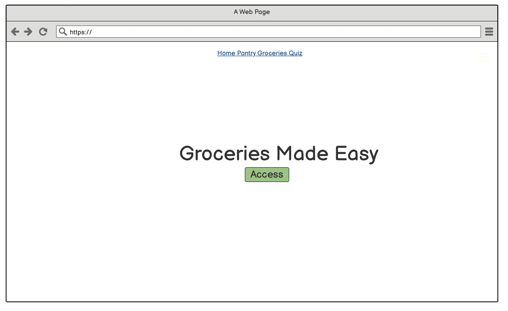
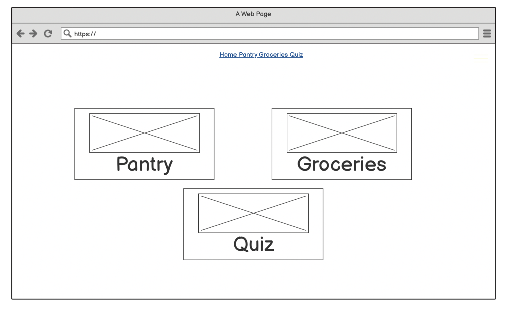
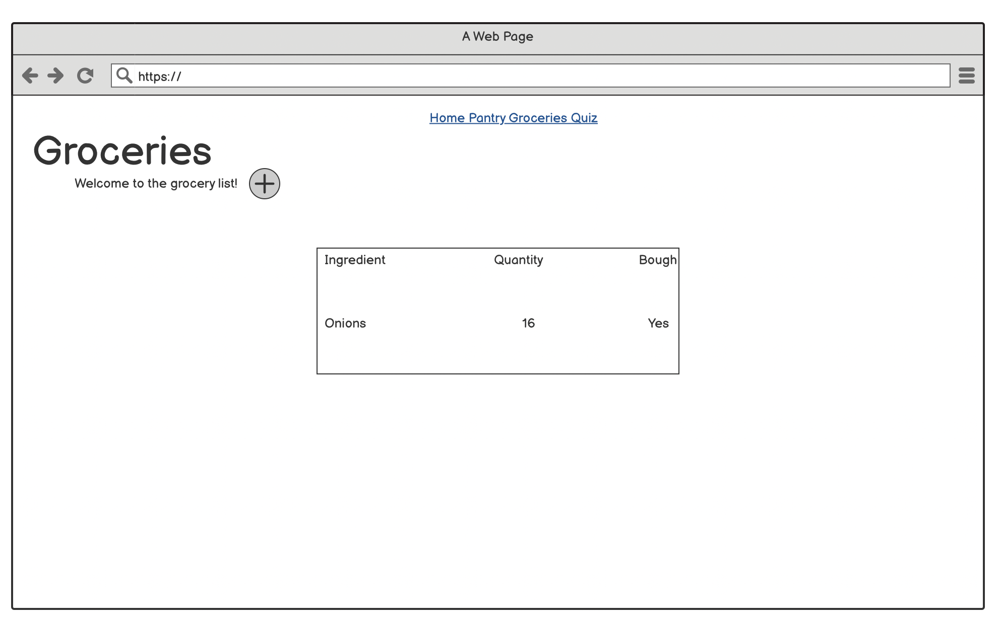
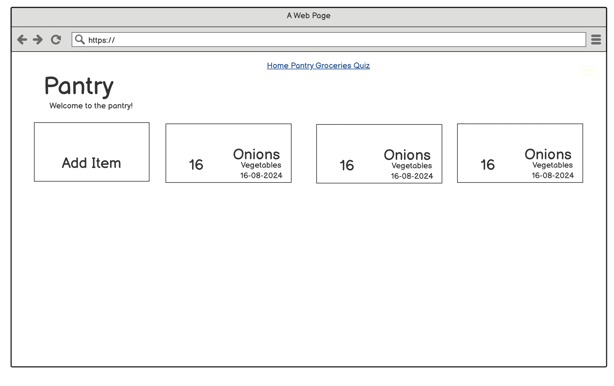
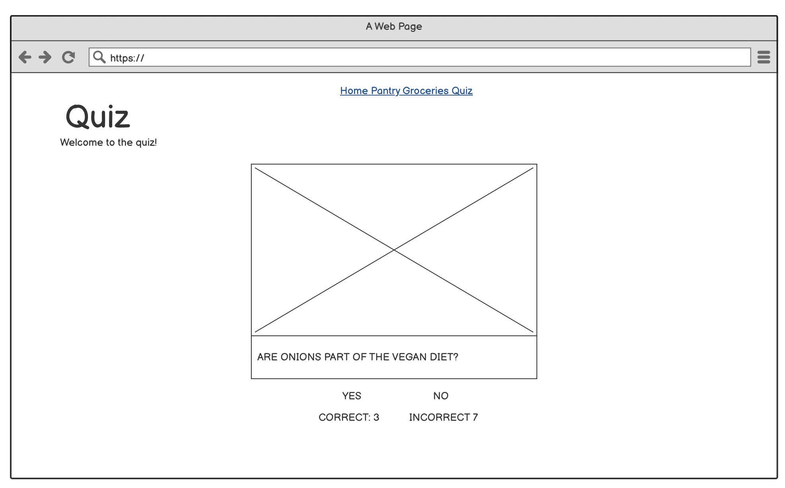

### **5. Surface Plane**

The surface plane is concerned with the visual aspects of the specific
features of the site. Below is each one listed with the design
principles alongside.

Font used: Inter.

Color scheme used:

  --clr-background: white;
	
  --clr-accent: #1E6249;
  
  --clr-button: #3EC193;
  
  --clr-button-red: #ec4747;
    
  --clr-card: #f5f5f5;
    
  --clr-font-sub: #606b5c;

Feature \#1: Navigation Bar

The navigation bar will be present in every page and will allow the user to jump from page to page in the website. It will show 
a hoverable element which will pull down the nav bar with all the links.

Feature \#2: Access Button
The button will take you to the dashboard. The button scales up when hovered over. 

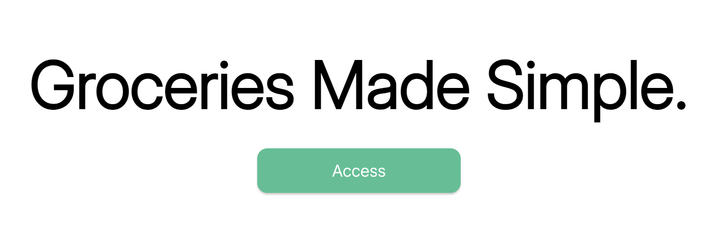

Feature \#3: Dashboard.

The dashboard has cards that scale up when hovered over. On smaller screens the items stack one after the other. 

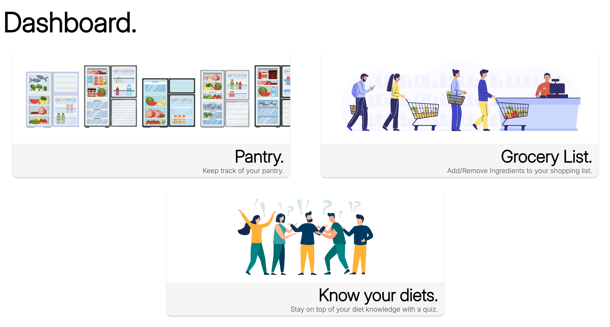

Feature \#4: Adding Pantry Items.

The pantry site has a title, subheader and a card that when clicked pops open a form to enter the input of new items. When the form is submitted a new item is added. 
The items can be modified in quantity and removed. 
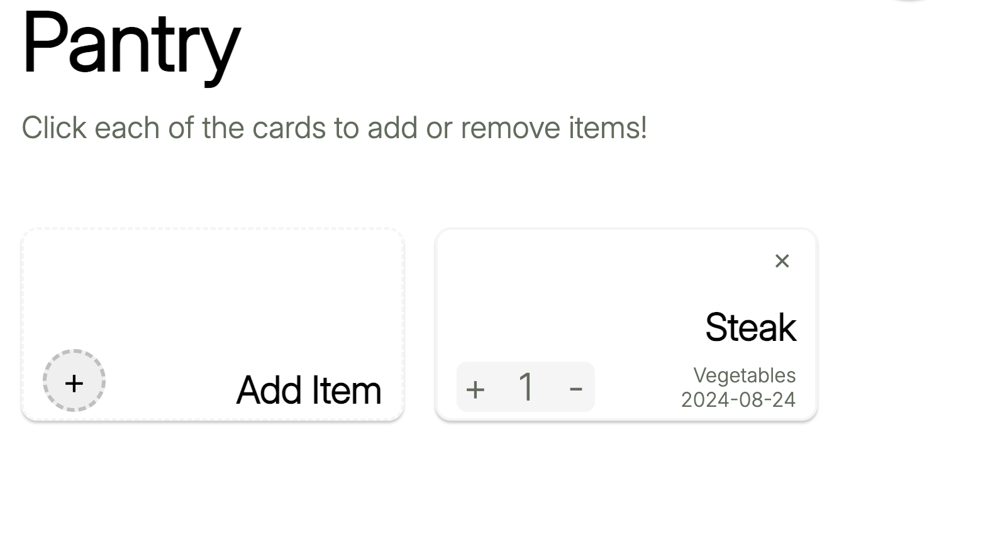
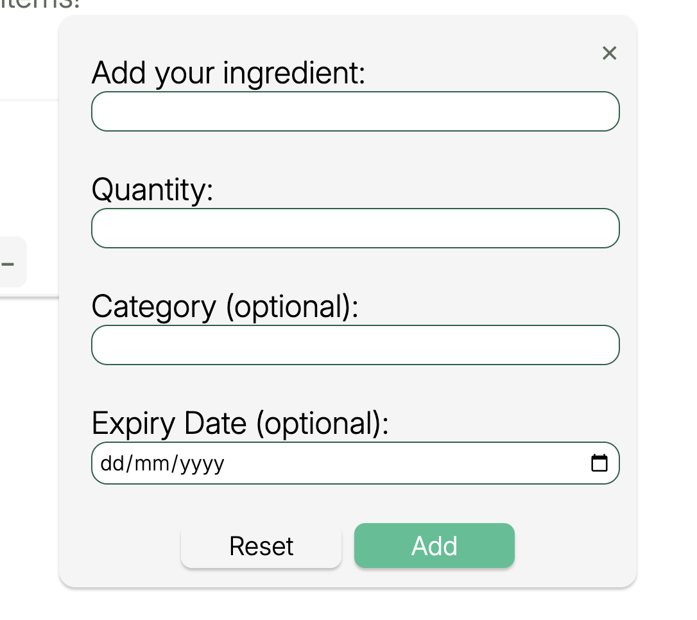

Feature \#5: Grocery List.

This section will have a title, subheader and an add preselected grocery list drop down list and an add button to prepopulate the grocery list. 
The grocery list is a table which can add ingredients, quantities and has a checkbox for bought items. 
A remove and add button remove or adds rows to the table. 
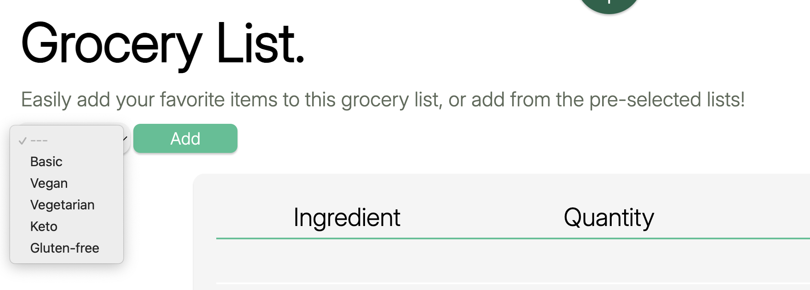
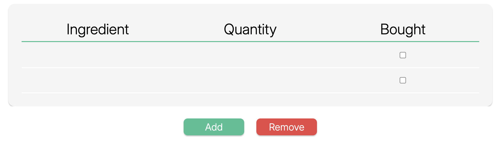

Feature \#6: Footer section.
The footer section has links to the authors LinkedIn and Github and has a link to the home page and the BBC good food page.
It also has a disclaimer. The links scale up when hovered over. 

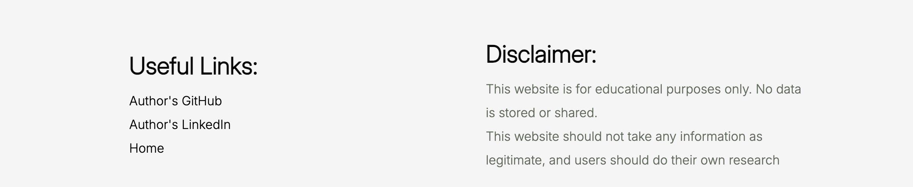

Feature \#7: Quiz.

The quiz has a title, subheader and greets you with a container containing a explanation sentence, a start button and a select rounds input box. The quiz won't let you start if the amount of questions exceeds 16 or is lower than 1. 
The quiz once started will randomize images and ingredient and diet pairs. If the ingredient and diet pairs are correct and you click on the yes button, then you will get a correct button, if the statement doesn't match your answer you will get an incorrect point.
Once the number of questions are done, an end of quiz slide will appear telling you the amount of question you got right. 

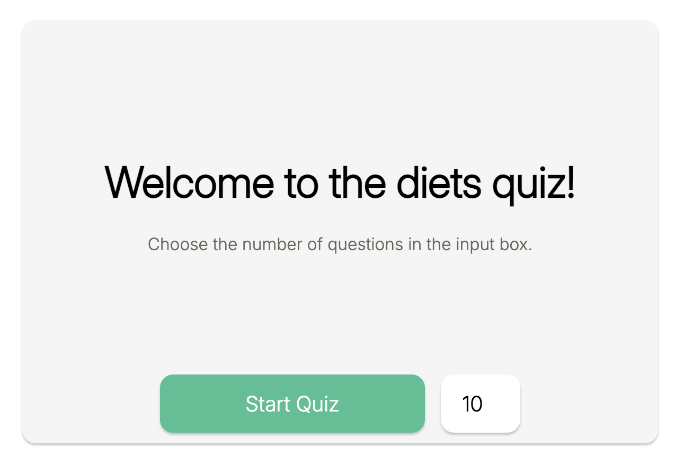
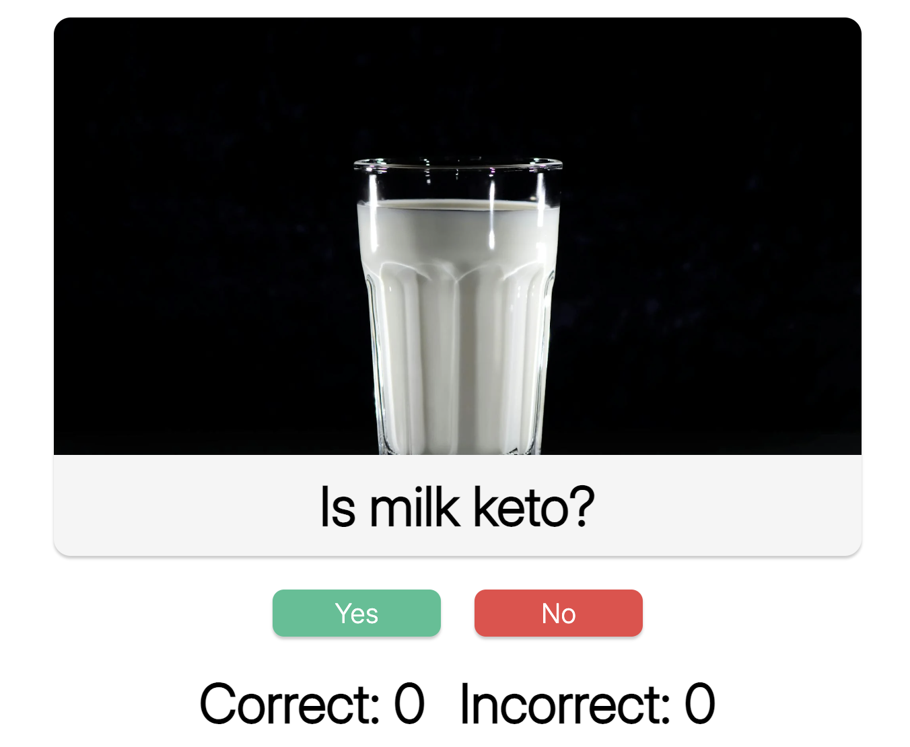
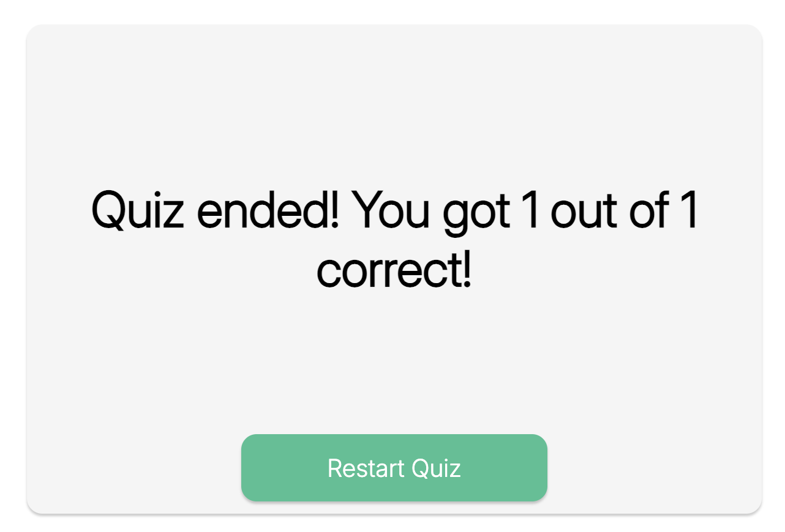

### **Technologies Used**

This project has been completed using the following:

<u>Languages:</u>

- HTML5

- CSS

- JavaScript

<u>Resources:</u>

- GitHub

- VSCode

- Google Fonts

- iStock

- Font Awesome

- Code Beautify

- Code Prettier

- Balsamic Wireframes

- Prefixer

- Favicon generator

### Features to add in the future.

<u> Light/Dark theme will be added, a media query would be added that changes the color scheme in the root. </u>

<u>The grocery lists will have a function to be saved to the local storage</u>

<u>A user registration system</u>

<u>Collaborative grocery list and pantry, where several users can add or odify to a grocery list.>

### **Testing**

Testing of this website has been done as follows:

1.  <u>Validators:</u>

- Google Lighthouse: Measures the performance, accessibility, best practices and SEO. Each of the sites were tested both in mobile and desktop. In all pages, the metrics for desktop and mobile were over 90. Google lighthouse can be acessed by right clicking the website, selecting "Inspect" and clicking on the "Lighthouse" tab, where an "analyse page load" button is available. 

- [HTML Validator](https://validator.w3.org/): Checks for any errors in the HTML code. No errors or warnigns were highlighted.

- [CSS Validator](https://jigsaw.w3.org/css-validator/): Checks for any errors in the CSS code. After running for style.css no errors or warnings were highlighted. 

- [JSHint](https://jshint.com/): Checks for any errors in the JavaScript. After running for all JavaScript files, no errors were found. Warnings regarding functions not being called were found, however, these were only for onclick attributes in html.

2.  <u>Browser compatibility:</u>

- Chrome: Pass

- Safari / Edge: Pass

- Firefox: Pass

3.  <u>Functionality</u>

<table>
<colgroup>
<col style="width: 9%" />
<col style="width: 20%" />
<col style="width: 28%" />
<col style="width: 26%" />
<col style="width: 15%" />
</colgroup>
<thead>
<tr class="header">
<th>Test ID</th>
<th>Test Label</th>
<th>Test Action</th>
<th>Expected Outcome</th>
<th>Test Outcome</th>
</tr>
<tr class="odd">
<th>T01</th>
<th>Nav bar button hovering</th>
<th>Hovering over the nav bar button.</th>
<th>The button should scale when hovered
over.</th>
<th>Pass</th>
</tr>
<tr class="header">
<th>T02</th>
<th>Nav bar button clicked</th>
<th>Clicking the button</th>
<th>The nav bar should pull down and show the nav bar links.</th>
<th>Pass</th>
</tr>
<tr class="odd">
<th>T03</th>
<th>Nav bar link </th>
<th>Nav bar link hovering</th>
<th>The links scale up and get underlined when hovered over</th>
<th>Pass</th>
</tr>
<tr class="header">
<th>T04</th>
<th>Access Button</th>
<th>Hovering and Clicking access button</th>
<th>THe button scales up when hovered over and takes you to the dashboard when clicked on </th>
<th>Pass</th>
</tr>
<tr class="odd">
<th>T05</th>
<th>Dahsboard Cards</th>
<th>Hovering and Clicking Dashboard cards</th>
<th>
THe cards scales up when hovered over and takes you to the respective page when clicked on 
</th>
<th>Pass</th>
</tr>
<tr class="header">
<th>T06</th>
<th>Dashboard cards responsiveness</th>
<th>Reducing the screen size</th>
<th>The cards change from in row to column when the screen size get reduced. The images appear sensibly</th>
<th>Pass</th>
</tr>
<tr class="odd">
<th>T07</th>
<th>Footer responsiveness</th>
<th>Reducing the screen</th>
<th>The footer changes from in row to column when the screen size get reduced. The links scale when hovered over.</th>
<th>Pass</th>
</tr>
<tr class="header">
<th>T08</th>
<th>Add Item</th>
<th>Add Item card hovering and clicking.</th>
<th>The add item card scales up when hovered over and opens the add ingredient form when clicked on.</th>
<th>Pass</th>
</tr>
<tr class="odd">
<th>T09</th>
<th>Add Ingredient Form</th>
<th>Submitting form</th>
<th>The form requires the name and quantity before adding an item, when submitted the item appears next to the add item card</th>
<th>Pass</th>
</tr>
<tr class="header">
<th>T10</th>
<th>Local Storage</th>
<th>Refreshing the screen</th>
<th>The items in the pantry will stay in the container when the pantry page is reloaded. </th>
<th>Pass</th>
</tr>
<tr class="odd">
<th>T11</th>
<th>Modifying Pantry Items</th>
<th>Clicking the close, "+" or "-" buttons in the pantry items</th>
<th>If the close feature is clicked the card will disappear even when refreshing. If the + or - buttons are clicked, the quanity is changed not below 0</th>
<th>Pass</th>
</tr>
<tr class="header">
<th>T12</th>
<th>Grocery List preselected lists</th>
<th>Clicking the preselected list features</th>
<th>The drop down will show different list options, clicking adding populates the grocery shopping list.</th>
<th>Pass</th>
</tr>
<tr class="odd">
<th>T13</th>
<th>Grocery Shopping List Responsiveness</th>
<th>Reducing the size of the screen</th>
<th>The grocery list will be scrollable horizontally in smaller screens</th>
<th>Pass</th>
</tr>
<tr class="header">
<th>T14</th>
<th>Adding removing lines to the Grocery List</th>
<th>Clicking the add or remove buttons at the bottom of the grocery list</th>
<th>Rows will appear or disappear when you click the respective buttons.</th>
<th>Pass</th>
</tr>
<tr class="odd">
<th>T15</th>
<th>Starting the quiz</th>
<th>Clicking start button and round selector</th>
<th>If the a start is attempted when the rounds are higher than 16 or lower than 1, the start will be prevented. Otherwise clicking start will change the card to a question, an image, buttons and counters. </th>
<th>Pass</th>
</tr>
<tr class="header">
<th>T16</th>
<th>quiz Logic</th>
<th>Operating the quiz</th>
<th>If a question is right, the statement will match the user's answer and the correct counter will increase by one. The opposite for the incorrect answer</th>
<th>Pass</th>
</tr>
<tr class="odd">
<th>T17</th>
<th>Ending the quiz</th>
<th>Reaching the number of rounds selected</th>
<th>When the number of rounds is reached, the container will change to a summary of the quiz and the option to restart is added. </th>
<th>Pass</th>
</tr>
</thead>
<tbody>
</tbody>
</table>

4.  <u>Responsiveness</u>

The site adheres as intended on every device. 

5. <u>Fixed bugs</u>

#### Incorrect counter 
The incorrect counter was increasing everytime the negative button was pressed. This has been sorted. 

#### Yes No Quiz buttons
The buttons would reload questions when pressed even if the quiz finished. This was sorted by removing the buttons on the end screen.

6. <u>Unfixed bugs</u>

#### Grocery List quantity can go negative
Due to lack of time, the grocery list quantity cells can go negative. To avoid this, a minimum value can be added to the input selector.

#### Quiz round input
The user can type a number higher than 16 in the quiz round selector and hit enter, while the quiz won't exceed 16 questions, the user might be misguided by the amount of questions that can be input. This could be fixed with JS. 

## **Deployment**

Deployment of this website has been done through the repository found in
GitHub.
([<u>https://github.com/RodriVazquezAsenjo/PP2-Gro-list</u>](https://github.com/RodriVazquezAsenjo/PP2-Gro-list))

Once in this link, click on the settings tab on the top navigation bar.

After, click on the pages tab on the left-hand menu under the code and
automation section.

Here, under the “Build and Deployment” on the “Source” drop-down menu,
select “Deploy from a branch”.

Next, select “Main” on the “Branch” drop-down menu, and ensure the
folder is set to /(root) and save.

This will automatically deploy your site, for confirmation, ensure that
a new section on the pages section shows up which states that the site
is live.

**Git Clone**

Git cloning is essentially creating a copy of an existing code from a
remote repository to your local repository. It is a key tool that allows
collaboration between developers when producing a code and also allows
for individuals to use an existing code as a baseline. When cloning a
code, the associated files, commit history, branches and tags when
downloaded to your local machine.

To clone a code you’ll need to follow these steps:

1.  Download the chrome extension for GitPod which can be found [<u>here</u>](https://chromewebstore.google.com/detail/gitpod/dodmmooeoklaejobgleioelladacbeki) and more information can be found [<u>here</u>](https://www.gitpod.io/docs/introduction).

2.  Restart your browser.

3.  Navigate to your desired Project Repository.

4.  On the top right corner a GitPod button should be seen. If pressed, it will take you to the GitPod workspace and open up a copy of the project repository you wish.

It is worth noting that any pushes intended to be done to the original
code will request approval from the author of the original code.

**Git Fork**

An alternative to cloning, which maintains a relationship to the
original repository, is forking. With forking you create a copy of a
repository to your own account on Github. This means that the two
repositories (original and forked) are now independent and the user is
free to make any changes to the repository.

To create a fork, follow these steps:

1.  Navigate to your desired repository.

2.  Click on the fork button on the top-right corner, above the GitPod button.

3.  Once forked, click on the GitPod Button.

## **Credits**

### Content:

ChatGPT4.0 has been used to create the preselected grocery shopping lists. Any other content has been written by
the developer.

### Imagery:

Images have been obtained from iStock.
Images have been obtained from the following links:
  
([<u>[https://www.istockphoto.com/es/vector/haga-cola-para-ir-a-la-tienda-de-comestibles-gente-con-carritos-de-la-compra-y-una-gm1356078844-430350164])</u>](https://www.istockphoto.com/es/vector/haga-cola-para-ir-a-la-tienda-de-comestibles-gente-con-carritos-de-la-compra-y-una-gm1356078844-430350164))
([<u>[https://www.istockphoto.com/es/vector/refrigerador-abierto-o-refrigerador-como-electrodom%C3%A9stico-para-el-almacenamiento-de-gm1552630827-526510147])</u>](https://www.istockphoto.com/es/vector/refrigerador-abierto-o-refrigerador-como-electrodom%C3%A9stico-para-el-almacenamiento-de-gm1552630827-526510147))
([<u>[https://www.istockphoto.com/es/vector/ilustraci%C3%B3n-vectorial-de-personas-que-se-comunican-en-busca-de-ideas-resoluci%C3%B3n-de-gm1789901645-547639970])</u>](https://www.istockphoto.com/es/vector/ilustraci%C3%B3n-vectorial-de-personas-que-se-comunican-en-busca-de-ideas-resoluci%C3%B3n-de-gm1789901645-547639970))

### Code:

Local Storage handling has been based on the youtube video: "How to create A Better To-Do List -Tutorial" by Web Dev Simplified posted 17 July 2019.

[<u>here</u>](https://www.youtube.com/watch?v=W7FaYfuwu70)

## **Acknowledgements**

Many thanks to my mentor Brian Macharia whose advice in coding has been
instrumental to the development of this website.

## **Contact Information**

- **Lead Designer:** Rodrigo Vázquez Asenjo
